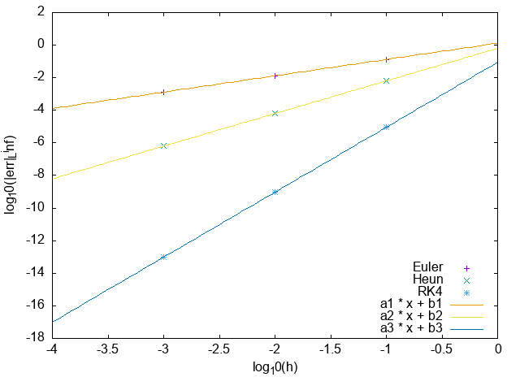

###
数値解法（一段法）

 - Euler 法 (1 次精度) : Xi+1 = Xi + hf(ti, Xi)
 - Heun 法 (2 次精度) : Xi+1 = Xi +h 2k1 + 2k2 , k1 = f(ti,Xi), k2 = f(ti +h,Xi +hk1)
 - Runge-Kutta 法 (4 次精度) : Xi+1=Xi+h 6k1+3k2+3k3+6k4 ,
k1 = f(ti, Xi), k2 = f(ti + 21h, Xi + 12hk1),
k3 = f(ti + 21h,Xi + 12hk2), k4 = f(ti + h,Xi + hk3)

 ###
 plot
